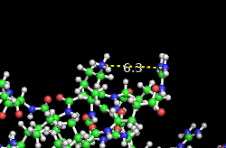
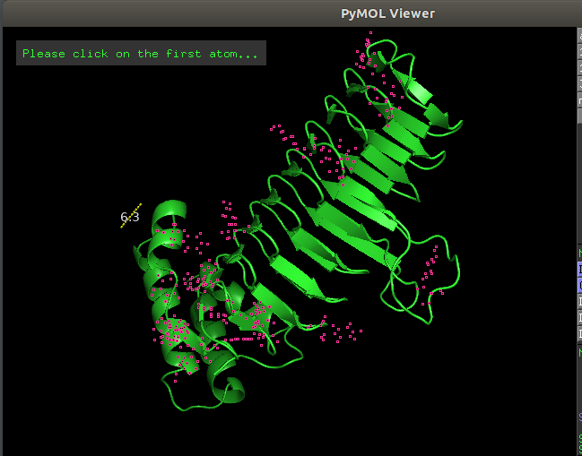
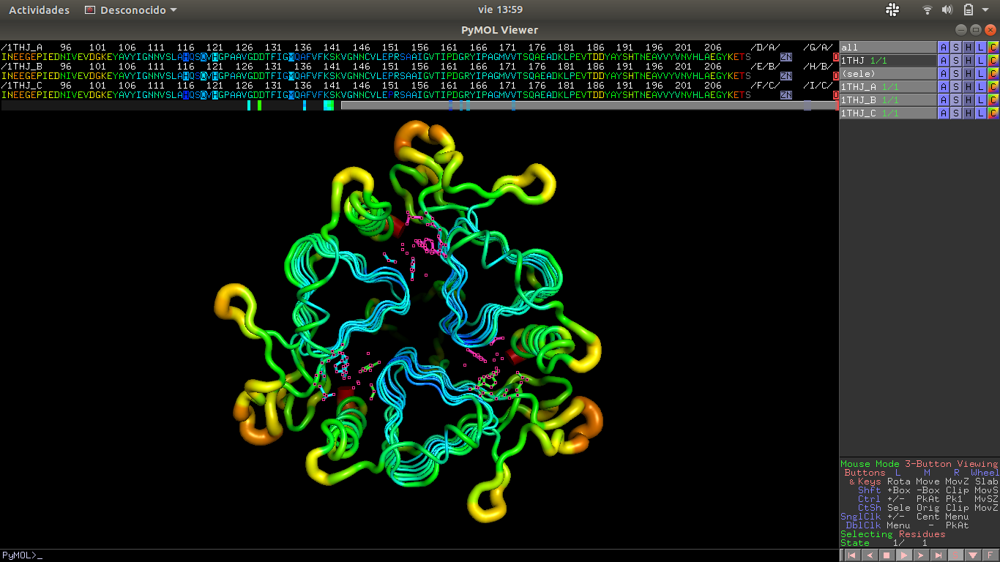

# TP 7

## Integrantes 
### - Esteban Cicovich
### - Nicolas Alvarez

## Tipos de proteinas ( Recordatorio )

- Proteinas Globulares
- Proteinas repetitivas
- Proteinas desordenadas
- Proteinas Fibrosas
- Proteinas Circulares
- Proteinas anudadas

## 1. ¿Cómo describís la estructura de esta proteína?
Tiene forma de proteina repetitiva, repite el mismo ciclo en el "tunel" que se forma.
### ¿Cómo podrías describir la estructura de esta proteína? Realizá la misma descripción pero para la proteína 1THJ, 3OGB,
- 1THJ: no lo tengo bien claro, claramente es repetitiva dentro de las cadenas, pero a nivel global creo que seria globular.

- 3OGB: Esta si, tiene mucha forma de globular :D.

## 4. Un mar de conformaciones...
### Estudiá la proteína 2CPE. ¿Qué tipo de proteína es? ¿Cómo la describirías? 

Es una proteina principalmente desordenada, tiene muchas ramificaciones sin definir y solo una pequeña parte estructurada.

### Utilizá el comando “setall_states, on” para ver todos los estados conformacionales estimados para esa estructura. Compará el espacio conformacional de la 2CPE con la de la estructura de la mioglobina (1MYF). Utilizando el modo secuencia, seleccioná la HIS 64. Mostrala en formato stick o lines. ¿Qué función podría llegar a tener?
Como va a unir ARN (Que en general tienen carga negativa), va a estabilizar la union con su ligando.
### ¿Y la HIS 93?
 Une la proteina con el grupo HEM.
 

## Reto I
---
## Estas estructuras difieren de las estructuras sobre las que venimos trabajando en su determinación. Como habrás notado estas fueron obtenidas mediante la técnica de MNR, ¿Pero en qué consiste esta técnica?

Consiste en poner la molecula en un campo magnetico muy fuerte y luego la bombardean con ondas de radiofrecuencia. El nucleo vibra a una frecuencia especifica, despues se analizan esas frecuencias y representan tridimensionalmente la estructura molecular

## Measurement

## Seleccion de atomos

## Reto II
--------
## Investigá en qué consisten las interacciones puentes de hidrógeno, π-π y π-catión y qué aminoácidos podrían intervenir en dichas interacciones.

Puentes de hidrógeno:  Es una clase de enlace que se produce a partir de la atracción existente en un átomo de hidrógeno y un átomo de oxígeno, flúor o nitrógeno con carga negativa. Basicamente, se trata de unir por medio de  un atomo de carga negativa (Oxigeno por ejemplo) con uno de carga negativa (Hidrogeno).

Las interacciones pi-catión en cambio, no son interacciones covalentes, es decir, no se intercambian atomos. Son enlaces no covalentes entre un conjunto pi (Conjunto de atomos enlazados covalentemente con carga negativa) y uno cation que tiene carga posit

No encontré mucha informacion entendible sobre las interacciones pi-pi, pero entiendo que son interacciones entre conjuntos pi y se encuentran en el ADN.

### 7. a. ¿Cuántas subunidades (cadenas) tiene la estructura nativa?

- La proteina 1THJ tiene 3 cadenas, se las puede visualizar haciendo `split_chains`

### b. ¿Tiene heteroátomos esta molécula? ¿Cuáles?
- Si, tiene un heteroatomo de zinc y uno de oxigeno en cada cadena.

## c. Identificá los residuos que unen el Zinc. 
Los zincs estan seleccionados con rosa.

## d. ¿Los residuos que unen el Zinc pertenecen a la misma subunidad?
No, cada residuo que une el zinc pertenece a una sub unidad diferente

## Reto III: Investigá en qué consiste el docking, en qué ideas basa su funcionamiento.
---
El docking o acoplamiento un metodo para predecir la forma de una molecula cuando se acopla a otra, en particular se puede utilizar con proteínas para visualizar si es posible vincularla con alguna molecula o fármaco.